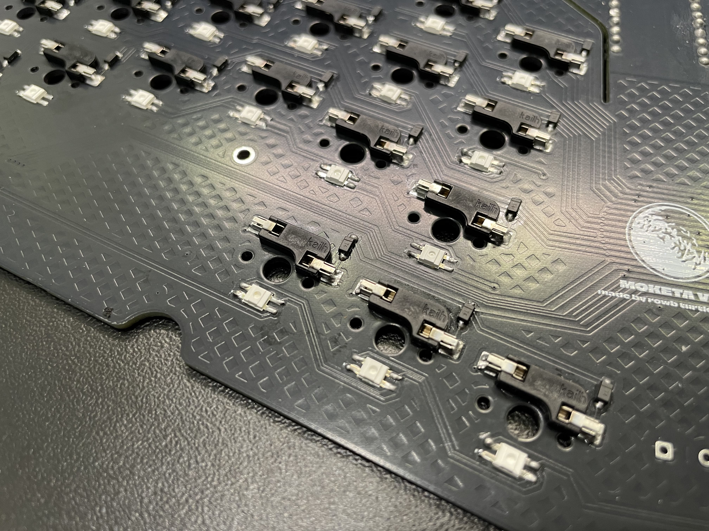
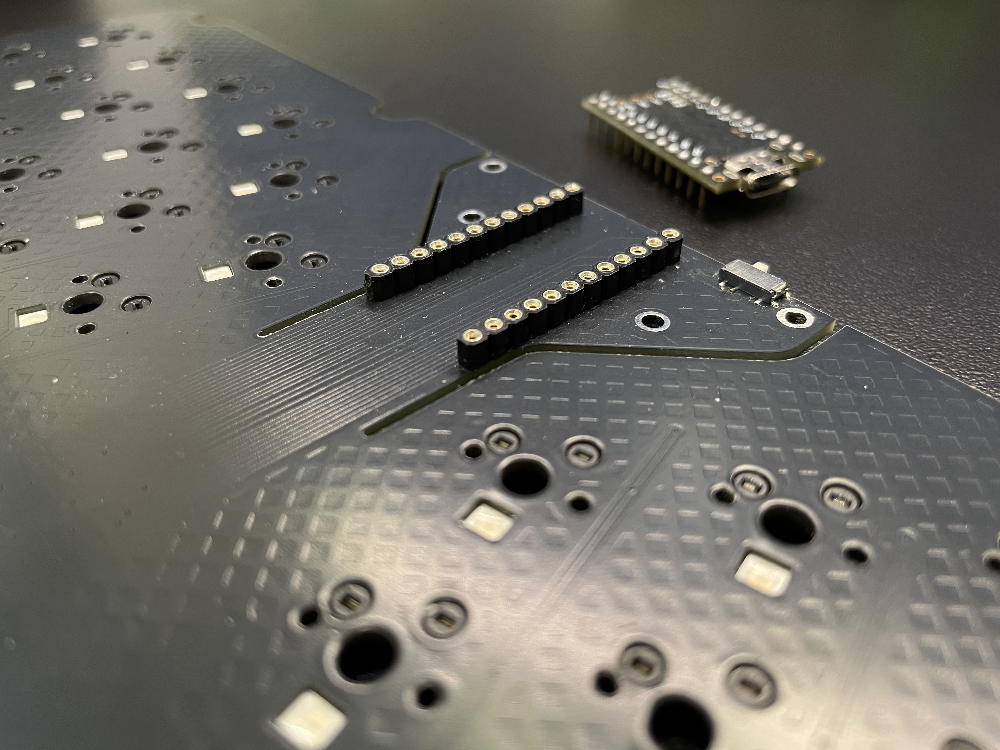
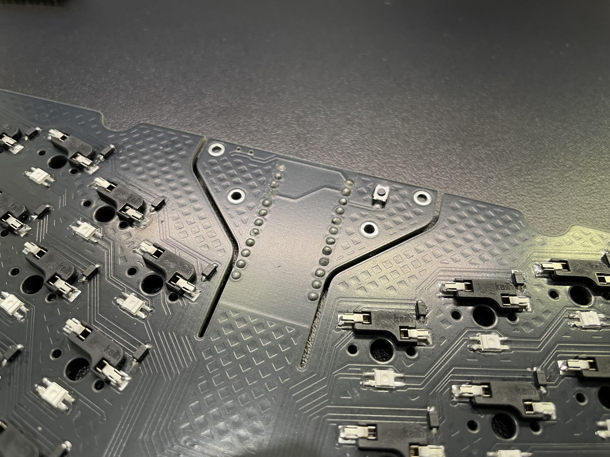
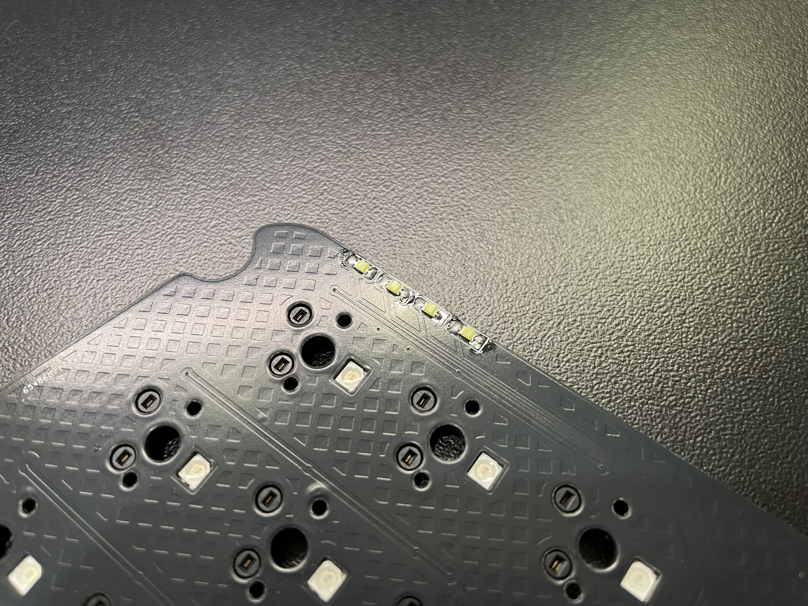
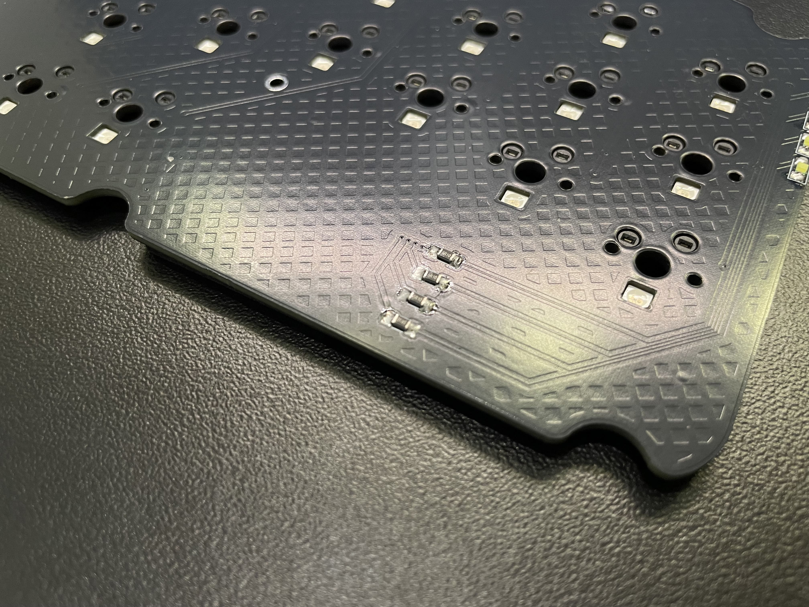

## 1. Soldering the diodes,hotswap and LED

Install the hotswap and solder it. Install the diode with the stripe facing up, and the LED with the trimmed leg toward the corner. All LEDs and diodes should face the same direction.

## 2. Solder MCU

Install the controller sockets on the top side of the board; trim the pins on the bottom side and solder them. Solder the sockets or wires for the controller, then insert the controller into the socket.

## 3. Solder control switch

Solder MSK12C02 on the top, and TS342A2P on the bottom side PCB

## 4. Solder resistor and LED

Install the 0805 LED with the green side facing down, and install the resistor (the resistor’s polarity does not matter).

