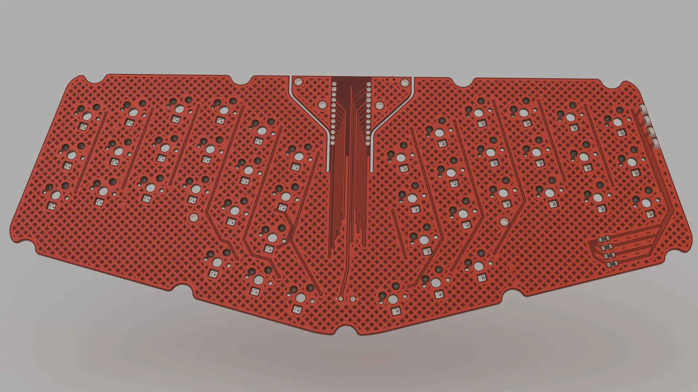
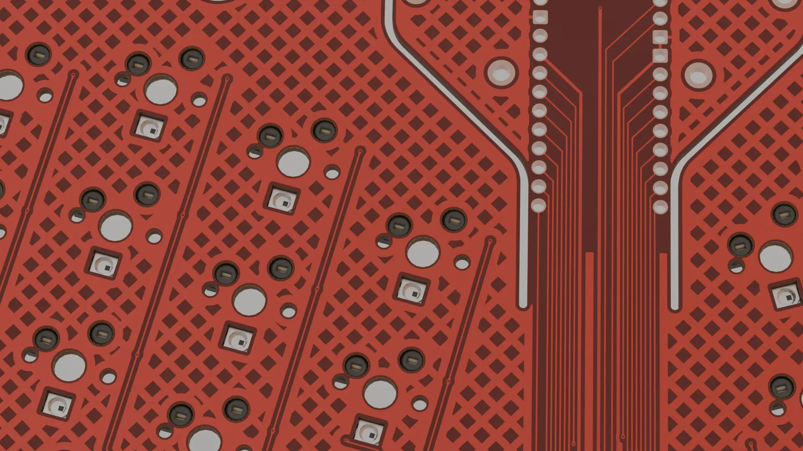
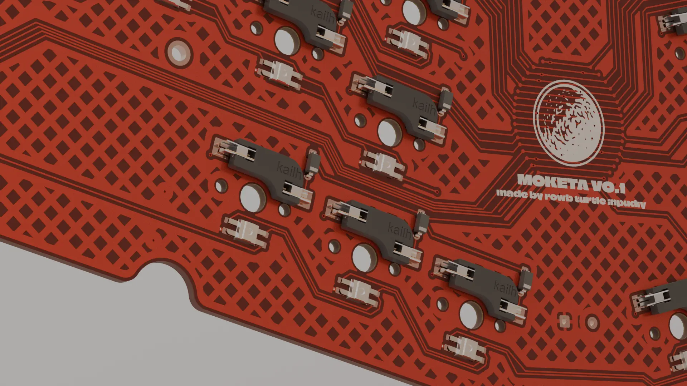
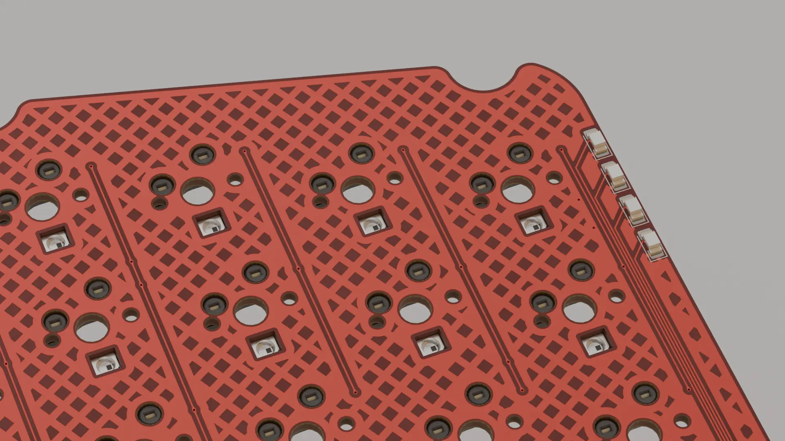

# MOKETA

MOKETA is an open-source unibody 42-key wireless keyboard with MX switches, per-key LEDs, status indicators, a 3D-printed box-mount case, and a hot-swappable Pro Micro–compatible controller.

[Gerber]() - [Case build]() - [ZMK Firmware](https://github.com/inpudiy/zmk-MOKETA)

## Features

- Unibody form factor with a 15 degree angle between halves
- 42-key column-staggered layout with MX switches
- 3D-printed box mount case
- 4 status LEDs inspired by the Aroum project
- Per-switch SK6812MINI-E LEDs
- Pro Micro compatible microcontroller with hot-swap (nice!nano, SuperMini NRF52840, Mikoto, or others)
- Optimized for wireless use: hardware power switch, reset button, battery solder pads, and ZMK firmware

## PCB Image

## Bill of materials

| Component                                                    | Qty/Pin |
| ------------------------------------------------------------ | ------- |
| Pro Micro board: Super Mini nRF52840 / nice!nano             | 1       |
| MSK12C02 Slide Switch                                        | 1       |
| TS342A2P                                                     | 1       |
| 50mm Industrial H62 brass wire 0.5mm thickness               | 1       |
| Silicone bumpers                                             | 6       |
| Machine Pin Header Female                                    | 24      |
| PG1511 hot-swap socket                                       | 42      |
| Diode 1N4148W (SOD-123)                                      | 42      |
| MX switches                                                  | 42      |